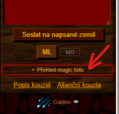
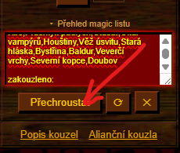
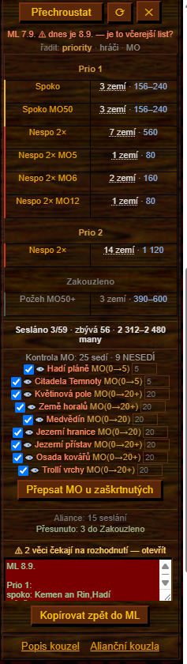
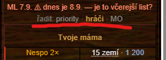
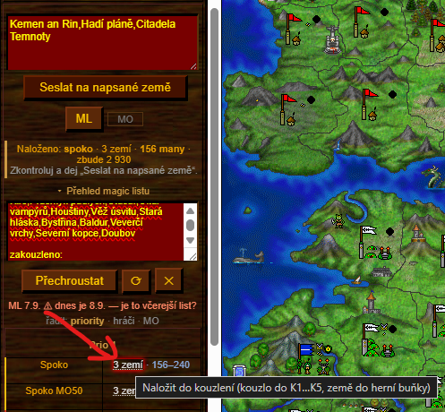
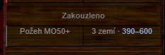

# Návod

Skript nedělá nic sám od sebe. Přečte magic list, doplní k němu, co ví z mapy
a z aliančních kouzel, a předvyplní ti formulář. **Poslední klik je vždycky tvůj.**

- [Kde to najdeš](#kde-to-najdeš)
- [Vložení magic listu](#vložení-magic-listu)
- [Přehled](#přehled)
- [Kontrola MO](#kontrola-mo)
- [Okno s nálezy](#okno-s-nálezy)
- [Kouzlení](#kouzlení)
- [Kouzlení na hráče](#kouzlení-na-hráče)
- [Během dne](#během-dne)
- [Kategorie](#kategorie)
- [Jak psát magic list](#jak-psát-magic-list)
- [Co skript neumí](#co-skript-neumí)

---

## Kde to najdeš

Otevři ve hře **Magie**. Pod herním formulářem přibude řádek
**„▸ Přehled magic listu"** — klikem se rozbalí.



Nad ním přibude tlačítko **ML** a vedle něj políčko **MO** — to je opačný směr,
z formuláře do listu, a je popsaný v [Z formuláře do listu](#z-formuláře-do-listu).

---

## Vložení magic listu

Vlep do pole celý list, jak ho máte v alianci — **nemusíš nic přepisovat do
zkratek**, skript si poradí i s tím, jak to píšou ostatní. Pak dej
**„Přechroustat"**.



Vedle jsou ještě **⟳** (načíst znovu alianční kouzla) a **✕** (smazat list
a začít nanovo).

---

## Přehled



Nahoře je **datum listu**. Když nesedí s dnešním dnem, skript se ozve:
*„ML 7.9. ⚠ dnes je 8.9. — je to včerejší list?"* Snadno se totiž stane, že
člověk edituje včerejšek.

Pod tím **„řadit: priority · hráči · MO"** — tři pohledy na tentýž list.
„Hráči" seskupí země podle majitele z mapy, takže si můžeš projet jednoho
protivníka najednou. **Společný list se tím nemění**, je to jen zobrazení.



### Řádky

Každý řádek je jeden požadavek: kouzlo, kolikrát, na kolik zemí a za kolik.

- **`Nespo 2× MO5 · 1 zemí · 80`** — dvakrát nespo na zem s magickou obranou 5.
- **Barevný proužek vlevo** ukazuje, jakou máš šanci to prokouzlit se svou SK.
- **Cena je rozsah** (`156–240`), protože se u některých kouzel počítá
  s **alianční slevou** — nižší číslo je s ní, vyšší bez.
- **Klik na řádek** (ne na počet zemí) otevře editor: MO, kouzlo, počet seslání
  i jednotlivé země. Zem se dá odebrat a dokud je editor otevřený, jde to vrátit.

### Souhrn

**`Sesláno 3/59 · zbývá 56 · 2 312–2 480 many`**

Je to postup **v tomhle listu**, ne tvůj denní limit: 3 seslání z 59 jsou hotová,
56 zbývá. **Cena je jen za to, co zbývá** — co je v Zakouzleno, se už nepočítá.

Počítají se **seslání, ne země**: `2×` na čtyřech zemích je osm seslání.

Úplně dole je uklizený list ve zkratkách a tlačítko **„Kopírovat zpět do ML"** —
ten se posílá zpátky do společného.

---

## Kontrola MO

Skript **dopočítá magickou obranu neutrálních zemí z mapy**, takže ji nikdo
nemusí psát ručně. Když se to, co spočítal, rozchází s listem, nabídne opravu:

> **Kontrola MO: 25 sedí · 9 NESEDÍ**
> ☑ Hadí pláně MO(0→5)
> ☑ Citadela Temnoty MO(0→5)

Zápis **`MO(0→5)`** znamená „v listu je 0, podle mapy je to 5". Číslo vedle
zaškrtávátka se dá přepsat, když víš líp. Pak **„Přepsat MO u zaškrtnutých"**.

**U hráčských zemí je dopočet nespolehlivý** — tam má list přednost, a proto se
nic nepřepisuje samo.

---

## Okno s nálezy

Otevřeš ho řádkem **„⚠ 2 věci čekají na rozhodnutí — otevřít"**. Vyskočí i samo,
když nálezů přibude — ale jen tehdy, **když máš otevřenou Magii**. Jakmile z ní
odejdeš, zavře se; nemá smysl, aby na tebe okno mluvilo o listu, který nevidíš.

### Fajfka, křížek, ignorovat

Každý řádek má vpravo dvě značky:

| Značka | Co udělá |
|---|---|
| **✓** | provede opravu — přepíše MO, vrátí zem do plánu, doplní čárku |
| **✗** | **ignoruje do půlnoci**: řádek zmizí dolů do „Ignorováno" a přestane se počítat |

**✓ je jen tam, kde je oprava jednoznačná.** Informativní řádky (neprošlo,
poslali totéž, škály) mají jen ✗ — u nich není co odklikat za tebe. U sporu na
škále fajfka schválně chybí: má pod sebou dvě pojmenované volby a jediné
tlačítko, které by jednu z nich vybralo, je přesně to, čím se dá omylem zakouzlit.

Když je ve skupině víc řádků, je v jejím nadpisu **„✓ vše"** — platí jen pro tu
skupinu, ne pro celé okno.

**Po každé akci se okno překreslí**, takže se seznam postupně zmenšuje, dokud
nezbude nic.

### Ignorováno

Ignorované se **neztrácí** — leží sbalené dole jako **„Ignorováno do půlnoci (3)"**
a odkazem **↩** se dá vrátit mezi nálezy. V přehledu je vidět „· 3 ignorováno".

Platí to na **přesně tu věc**: zem, kouzlo, druh nálezu i čísla. Když se situace
změní (jiná MO, jiná síla seslání), je to nový nález a ozve se znovu. O půlnoci
je stejně všechno jinak, takže se seznam sám vynuluje.

### Co v okně bývá

**Otázky** — když ve štítku zbyde text, skript se zeptá, jestli je to jméno
hráče, nebo poznámka. U čísla řádku vidíš, čeho se to týká. Když všechny země
toho řádku patří jednomu hráči, nabídne ho v roletce.

> Jméno hráče se z listu **zahazuje**, poznámka u řádku **zůstane**.

Odpověď si pamatuje; zapomenout ji jde odkazem **„zapomenout uložená rozhodnutí"**.

**Chyby zápisu** — chybějící čárka, kouzlo, které nepoznal, zem, která na mapě
není. Skript to **neopravuje sám** — jen řekne, kde to je. Přidat jednu čárku
ručně je míň práce než tomu věřit.

**Poslali totéž** — stejné kouzlo na tutéž zem od více lidí. U nespo to bývá
záměr (skládá se), u ostatních většinou ne.

**Škály** — na zem už letí něco, co dělá totéž, takže nemá smysl posílat plný
počet.

---

## Kouzlení

### Z listu do formuláře

Klik na **počet zemí** u řádku naloží dávku do herního formuláře: kouzlo do
roletek K1…K5 (kolikrát, tolik roletek), země do herní buňky — a rovnou je
**zaškrtne na mapě**.



### Víc řádků najednou

Když je v listu několik řádků téhož kouzla, které se liší jen magickou obranou,
nemusíš je kouzlit po jednom:

- **klik přičte** další řádek k tomu, co je naložené,
- **klik na už naložený řádek ho zase odebere** (pozná se podle ✓ u počtu zemí),
- **klik na jiné kouzlo začne nanovo**.

Slévají se jen řádky **stejného kouzla a stejného počtu seslání**. `2×nespo`
a `nespo` dohromady nejdou: formulář má jednu sadu zemí pro všechny roletky,
takže by dvojka spadla i na země z jednonásobného řádku.

Země si můžeš ubrat i **přímo na mapě** — co tam odklikneš, zmizí z dávky
a dalším klikem se nevrátí. **V magic listu ta zem zůstane** jako nezakouzlená;
naložení je jen příprava formuláře, do listu nesahá.

> ⚠ Zem, kterou hra nezná (překlep v listu), **zablokuje celé seslání** — hra
> na první nenalezené jméno nepošle nic. Skript proto varuje předem:
> *„⚠ Mapa nezná: Kutovv. Dokud to v buňce zůstane, hra seslání odmítne."*

Pod tlačítky pak uvidíš, co se naložilo a co tě to bude stát:

> **Naloženo: spoko · 3 zemí · 156 many · zbude 2 930**
> Zkontroluj a dej „Seslat na napsané země"

Ten řádek **žije** — mění se, jak přehazuješ roletky nebo dopisuješ země, i když
to naklikáš ručně bez skriptu. Když by dávka byla nad tvoje možnosti, ozve se:
**„⚠ Na tohle nemáš manu."**

**Odeslat musíš sám herním tlačítkem.** Skript na ně nesahá, takže se přes něj
nedá omylem zakouzlit.

### Z formuláře do listu

Opačný směr. Když si kouzla naklikáš rovnou ve hře, nemusíš totéž psát ještě
do listu — udělá to za tebe tlačítko **ML** pod „Seslat na napsané země".

Vezme, co je v roletkách K1…K5 a v herní buňce, a **rozdělí země podle jejich
magické obrany**. Když má pět zemí tři různé MO, vzniknou tři řádky — každý se
svou hodnotou, ne jeden společný průměr.

Pak se rozbalí nabídka ke schválení:

> **Z formuláře — přidat do ML:**
> do kategorie [ Prio 1 ▾ ]
> ☑ spoko 2× · 3 zemí  [ 20 ]
> ☑ spoko 2× · 1 zem   [ 55 ]
> **[ Přidat do ML ]**

- **Kategorie** si vybereš z roletky (výchozí je Prio 1).
- **Zaškrtávátkem** řádek vynecháš — hodí se, když jsi něco naklikal jen na zkoušku.
- **Číslo vpravo** je MO, která se zapíše do listu. Je předvyplněná z mapy a dá
  se přepsat; **prázdné pole = bez MO**, tedy požadavek 0.
- Najetím myší na řádek se ukáže, o které země jde.

Do listu se to zapíše až tlačítkem **„Přidat do ML"**.

### Políčko MO vedle tlačítka

Malé políčko hned za **ML** zkracuje cestu:

| Políčko | Co se stane |
|---|---|
| **prázdné** | MO se dopočítá z mapy a nabídne se ti ke kontrole (postup výš) |
| **číslo** | řádky se s tou MO vloží do listu **rovnou, bez schvalování** |

Číslo se použije **pro všechny napsané země najednou**, takže se hodí, když
víš, že jsou na tom stejně — jinak nech políčko prázdné a nech si země rozdělit.

---

## Kouzlení na hráče

Hra umí na stránce **Aliance** vysypat tlačítkem soupisku protivníků rovnou
do magic listu:

```
ML 12.9.

Donzo - 33 - // -
konikPD - 15 - /Arratan,Úrodné pláně/ - nespa od Kaprika
```

Jméno, počet zemí, mezi lomítky země, **kam jde útok**, a za poslední pomlčkou
volný text, který si aliance píše sama.

**Když takový řádek v listu je**, objeví se v přehledu nahoře blok
**„Kouzlení na hráče"**. Bez něj se nic nemění a přehled vypadá jako vždycky.

Klik na hráče rozbalí jeho země z mapy, rozdělené **podle magické obrany**:

```
▾ Donzo · 33 zemí
  MO0 · 12 z 12     Krupky, Kutov, …
  MO20+ · 3 z 3     Elfí přístavy, …
```

- **Klik na dávku** naloží ty země do formuláře. **Kouzlo si vybereš sám** —
  ze soupisky se nedá poznat, co na kterou zem chceš poslat.
- **`MO20+`** s plusem znamená odhad: víš, že obrana je aspoň tolik, ale vojsko
  ji může zvednout. Bez plusu je hodnota změřená.
- **Země, kam jde útok** (mezi lomítky), se do dávek nepočítají.
- **Země, na kterou dnes už něco prošlo, se nenaloží** a je ve výpisu
  přeškrtnutá i s tím, kdo na ni co hodil. Odražené seslání se za hotovou práci
  nepočítá — ta zem v dávce zůstává a je oranžová.
- Najetím na zem se ukáže **jaká je na ní věž**. Magická centra se podle síly
  vojska poznat nedají, takže si je musíš vytipovat sám.

Když **počet zemí v listu nesedí s mapou**, řekne se to u jména i v okně
s nálezy. Opravit se to nedá — číslo v listu počítá hra a list je společný —
takže je u toho jen ✗.

Po zakouzlení se hráči **dopíše do poznámky**, co kdo odvedl:

```
Donzo - 33 - // - krupky MO0, MO50 by Gorin
konikPD - 15 - /Arratan,…/ - nespa od Kaprika · krupky MO0 (chybí Kutov) by Gorin
```

`(chybí …)` jsou země, které ze své dávky kouzlo nedostaly. Odražená seslání se
nepropisují. Ruční text aliance zůstává vlevo, oddělený tečkou.

---

## Během dne

Tlačítkem **⟳** si skript načte znovu alianční kouzla a porovná je s listem.
Pod souhrnem pak vidíš **„Aliance: 15 seslání"** a **„Přesunuto: 3 do Zakouzleno"**.

- Co je hotové, přesune do **Zakouzleno**.
- Co neprošlo, nechá v plánu **i s důvodem** — buď síla nesplnila MO z listu,
  nebo se to podle mapy odrazilo.
- Hlídá násobky: `2×nespo` s jedním sesláním **není hotovo**. Rozdělaná práce
  je vidět i v listu — `2×nespo (1 ze 2): Delta` znamená „jedno seslání prošlo,
  jedno zbývá". Poznámka se přepočítává z aliančních kouzel, takže se o půlnoci
  vynuluje sama a nikdo ji nemusí mazat.
- Jedno seslání zaplatí **jen jeden řádek**. Když máš tutéž zem ve dvou
  prioritách (první nespo povinné, druhé když vyjde mana), po jednom zakouzlení
  ti ta druhá zůstane v plánu — správně.

Odkazem **„↩ vrátit do plánu"** jde přesun vzít zpátky.

---

## Kategorie

Pořadí je pevné a nadpis se ukáže jen tam, kde něco je. **Zakouzleno je
zašedlé** — hotová práce nemá tahat oči.



| Kategorie | K čemu |
|---|---|
| **Top prio** | řádek s `!` — jde nahoru |
| **Prio 1 – Prio 3** | běžná práce podle důležitosti |
| **Pro jistotu překouzlit s max SK** | jen řádky, které si výslovně řekly o silné seslání (`_SKmax` nebo `_SK39+`) a dostaly slabý hod. Je to kategorie **na zbytek many** |
| **Zakouzleno** | hotovo |

Sekce se dá psát i malým písmem (`zakouzleno:`), skript si poradí.

---

## Jak psát magic list

Skript si poradí s tím, jak píšou lidi. Tohle je zápis, do kterého to sjednotí:

| Zápis | Znamená |
|---|---|
| `nespo: Alfa,Beta` | seslat nespo na Alfu a Betu |
| `2×nespo: Alfa` | dvakrát nespo na Alfu |
| `nespo_MO20: Alfa` | zem má MO 20, sešli dost silně |
| `nespo_MO20+: Alfa` | MO je aspoň 20 |
| `nespo: Alfa (57),Beta (58)` | MO zvlášť pro každou zem |
| `nespo_neu: Alfa` | neobsazená zem, které se MO **nepodařilo** spočítat — zjisti si ji sám |
| `nespo_SKmax: Alfa` | tohle chce **nejsilnější seslání, co aliance má** |
| `Požeh_SK39+: Alfa` | sešli to **silou aspoň 39** — totéž, jen s číslem místo „co nejvíc". Čte se i `SK39`, `sk 39+` |
| `2×nespo (1 ze 2): Alfa` | z dvojitého seslání je hotové jedno. **Píše to skript sám**, ty to psát nemusíš |
| `! nespo: Alfa` | nejvyšší priorita |
| `spoko OMV: Alfa` | zkratka věže místo čísla (`OSV` 5, `MMV` 20, `OMV` 50) |

Fungují i volnější zápisy — `2x nespo`, `SmD2x`, `nespo MO 10+`, `Dvojnespo`,
země napsané před kouzlem i za ním, dvojité mezery za čárkami.

Slovo **„neutrálka"** napsané ručně se zahodí — skript si neobsazenost ověří
z mapy sám a MO dopočítá.

---

## Co skript neumí

- **Nekouzlí sám** a nesahá na herní tlačítko odeslání.
- **Nepamatuje si nic přes přepočet.** Porovnává list s tím, co aliance seslala
  **dneska** — bere to z aliančního seznamu kouzel, který se o půlnoci vynuluje.
  Zpětně nic nedohledá; druhý den se začíná nanovo.
- **Neopravuje chyby zápisu sám** — jen ukáže, kde jsou.
- **U hráčských zemí je dopočet MO nespolehlivý.** Tam platí, co je v listu.
- **Nevidí manu ostatních**, jen jejich zbývající kouzla. Tvoji vlastní manu zná
  a po naložení dávky ti ukáže, kolik zbude.
