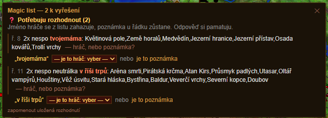

# Návod

Skript nedělá nic sám od sebe. Přečte magic list, doplní k němu, co ví z mapy
a z aliančních kouzel, a předvyplní ti formulář. **Poslední klik je vždycky tvůj.**

- [Kde to najdeš](#kde-to-najdeš)
- [Vložení magic listu](#vložení-magic-listu)
- [Přehled](#přehled)
- [Okno s nálezy](#okno-s-nálezy)
- [Kouzlení](#kouzlení)
- [Během dne](#během-dne)
- [Kategorie](#kategorie)
- [Jak psát magic list](#jak-psát-magic-list)
- [Co skript neumí](#co-skript-neumí)

---

## Kde to najdeš

Otevři ve hře **Magie**. Nad herním formulářem přibude řádek
**„▸ Přehled magic listu"** — klikem se rozbalí.

<!--  -->

---

## Vložení magic listu

Vlep do pole celý list, jak ho máte v alianci — **nemusíš nic přepisovat do
zkratek**, skript si poradí i s tím, jak to píšou ostatní. Pak dej
**„Přechroustat"**.

<!--  -->

Co se stane:

- rozpozná kouzla, násobky, MO a země,
- **dopočítá magickou obranu neutrálních zemí z mapy**, takže ji nikdo nemusí psát ručně,
- sjednotí zápis a list zase složí,
- co nedává smysl, ukáže v [okně s nálezy](#okno-s-nálezy).

Tlačítkem **„Kopírovat zpět do ML"** dostaneš uklizený list ve zkratkách —
ten se posílá zpátky do společného.

---

## Přehled

Každý řádek je jeden požadavek: kouzlo, kolikrát, na které země, s jakou MO.

<!--  -->

- **Číslo v závorce u země** je magická obrana právě té země. Řádek se proto
  nemusí štípat po jedné zemi.
- **Barva** napovídá, jak jsi na tom se svou SK — jestli má smysl, abys to
  sesílal ty, nebo je lepší poprosit někoho silnějšího.
- **Cena** dole je orientační součet many za celý list. Počítají se **seslání,
  ne země**: `2×` na čtyřech zemích je osm seslání.
- **Klik na řádek** otevře editor — dá se změnit MO, kouzlo, počet seslání
  i seznam zemí. Zem se dá i odebrat (dokud je editor otevřený, jde to vrátit).

Vpravo nahoře jsou tři pohledy na tentýž list: **priority**, **hráči**, **MO**.
Pohled „hráči" bere majitele zemí z mapy — hodí se, když chceš projet jednoho
protivníka najednou. Společný list se tím nemění.

<!--  -->

---

## Okno s nálezy

Sem jde všechno, co je potřeba rozhodnout nebo opravit.

<!--  -->

**Chyby zápisu** — chybějící čárka, kouzlo, které nepoznal, zem, která na mapě
není. Skript to **neopravuje sám a nepamatuje si to** — jen řekne, kde to je.

**Otázky** — když ve štítku zbyde text, zeptá se, jestli je to **jméno hráče**,
nebo **poznámka**. Když všechny země toho řádku patří jednomu hráči, nabídne ho
jako odpověď. Rozhodnutí si zapamatuje; zapomenout je jde odkazem dole.

**Kontrola MO** — MO napsaná v listu nesedí s tím, co vidí na mapě.
Zaškrtneš, co se má přepsat, a dáš **„Přepsat MO u zaškrtnutých"**.
U hráčských zemí je dopočet nespolehlivý, tam má list přednost.

**Poslali totéž** — stejné kouzlo na tutéž zem od více lidí. U nespo to bývá
záměr (skládá se), u ostatních většinou ne.

**Škály** — na zem už letí něco, co dělá totéž. Pak nemá smysl posílat plný počet.

---

## Kouzlení

Klik na počet zemí u řádku **naloží dávku do herního formuláře**: kouzlo do
roletek K1…K5 (kolikrát, tolik roletek) a země do herní buňky.

<!--  -->

**Odeslat musíš sám herním tlačítkem.** Skript na ně nesahá, takže se přes něj
nedá omylem zakouzlit.

Opačným směrem: když si kouzla naklikáš ručně, tlačítkem **ML** je načteš jako
požadavek do listu — ať to nemusíš psát dvakrát. Nabídne se ti to k potvrzení.

---

## Během dne

Tlačítkem **⟳** si skript načte znovu alianční kouzla a porovná je s listem.

<!--  -->

- Co je hotové, přesune do **Zakouzleno**.
- Co neprošlo, nechá v plánu **i s důvodem** — buď síla nesplnila MO z listu,
  nebo podle mapy se to odrazilo.
- Hlídá násobky: `2×nespo` s jedním sesláním **není hotovo**.
- Jedno seslání zaplatí **jen jeden řádek**. Když máš tutéž zem ve dvou
  prioritách (první nespo povinné, druhé když vyjde mana), zakouzlením jednou
  ti ta druhá zůstane v plánu — správně.

Odkazem **„↩ vrátit do plánu"** jde přesun vzít zpátky.

---

## Kategorie

Pořadí je pevné, nadpis se ukáže jen tam, kde něco je:

| Kategorie | K čemu |
|---|---|
| **Top prio** | řádek s `!` — jde nahoru |
| **Prio 1 – Prio 3** | běžná práce podle důležitosti |
| **Pro jistotu překouzlit s max SK** | jen řádky, které si výslovně řekly o nejsilnější seslání (`_SKmax`) a dostaly slabý hod. Je to kategorie **na zbytek many** |
| **Zakouzleno** | hotovo |

---

## Jak psát magic list

Skript si poradí s tím, jak píšou lidi, ale tohle je zápis, do kterého to
sjednotí — a který se hodí znát:

| Zápis | Znamená |
|---|---|
| `nespo: Alfa,Beta` | seslat nespo na Alfu a Betu |
| `2×nespo: Alfa` | dvakrát nespo na Alfu |
| `nespo_MO20: Alfa` | zem má MO 20, sešli dost silně |
| `nespo_MO20+: Alfa` | MO je aspoň 20 |
| `nespo: Alfa (57),Beta (58)` | MO zvlášť pro každou zem |
| `nespo_neu: Alfa` | neobsazená zem, které se MO **nepodařilo** spočítat — zjisti si ji sám |
| `nespo_SKmax: Alfa` | tohle chce **nejsilnější seslání, co aliance má** |
| `! nespo: Alfa` | nejvyšší priorita |
| `spoko OMV: Alfa` | zkratka věže místo čísla (`OSV`, `MMV`, `OMV`) |

Fungují i volnější zápisy — `2x nespo`, `SmD2x`, `nespo MO 10+`, `Dvojnespo`,
země napsané před kouzlem i za ním. Nadpisy sekcí (`Prio 1:`, `Zakouzleno:`)
se berou tak, jak jsou, i malým písmem.

Slovo **„neutrálka"** napsané ručně se zahodí — skript si neobsazenost ověří
z mapy sám a MO dopočítá.

---

## Co skript neumí

- **Nekouzlí sám** a nesahá na herní tlačítko odeslání.
- **Nepamatuje si nic přes přepočet.** Porovnává list s tím, co aliance
  seslala **dneska** — bere to z aliančního seznamu kouzel, který se o půlnoci
  vynuluje. Zpětně nic nedohledá; druhý den se začíná nanovo.
- **Neopravuje chyby zápisu sám** — jen ukáže, kde jsou.
- **U hráčských zemí je dopočet MO nespolehlivý.** Tam platí, co je v listu.
- **Manu nehlídá.** Cena je jen orientační součet; kolik jí máš, si musíš
  ohlídat sám.
